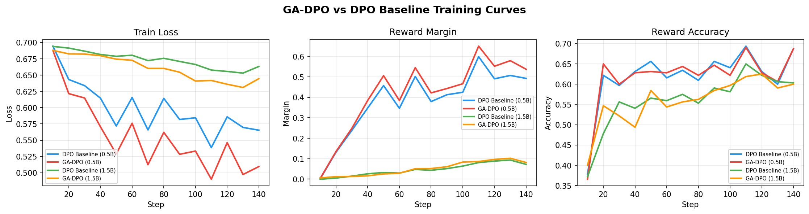

# Geometry-Aware DPO (GA-DPO)

A novel DPO variant that dynamically weights the per-sample loss based on the geometry of chosen/rejected hidden representations. Pairs that are ambiguous (high cosine similarity) or easy (large margin) are down-weighted; hard, informative pairs are emphasized.

## Method

Standard DPO treats all preference pairs equally:

```
L_DPO = mean( -log σ(β * (log π_θ(y_w|x) - log π_ref(y_w|x) - log π_θ(y_l|x) + log π_ref(y_l|x))) )
```

GA-DPO adds per-sample geometry weights:

```
L_GA-DPO = mean( w_i * L_DPO_i )

w_i = f(cos_sim(h_w, h_l), L2(h_w, h_l), margin, entropy)
```

Where `h_w`, `h_l` are the last-layer hidden states of chosen/rejected responses. Weights are **detached** — no gradient flows through the geometry computation.

## Results

All runs: `Qwen2.5-Instruct + QLoRA (r=16)`, UltraFeedback, 5000 samples, 1 epoch.

### Qwen2.5-0.5B

| Method | Eval Loss | Reward Margin | Accuracy |
|---|---|---|---|
| DPO Baseline | 0.593 | 0.403 | 64.4% |
| **GA-DPO** | **0.552** | **0.433** | 64.0% |

GA-DPO achieves **+7.5% higher reward margin** with comparable accuracy. The improvement comes primarily from pushing rejected responses further down (rewards/rejected: −0.43 vs −0.29), consistent with the geometry weights identifying hard pairs and emphasizing their gradients.

### Qwen2.5-1.5B

| Method | Eval Loss | Reward Margin | Accuracy |
|---|---|---|---|
| DPO Baseline | 0.668 | 0.060 | 58.8% |
| **GA-DPO** | **0.650** | **0.073** | 56.4% |

Both metrics improve with GA-DPO. Low absolute margins are expected — 5000 samples / 148 steps is insufficient for the 1.5B model; full experiments use 20k samples.

> **Note**: Eval loss is comparable between methods. GA-DPO applies geometry weights only during training; evaluation uses uniform weights identical to the DPO baseline.

### Training Curves



## Setup

```bash
conda create -n gadpo python=3.11 -y
conda activate gadpo
pip install torch torchvision torchaudio --index-url https://download.pytorch.org/whl/cu128
pip install transformers datasets "trl>=1.4.0" peft bitsandbytes accelerate pyyaml einops
pip install -e .
```

## Training

```bash
# DPO Baseline
python scripts/train_dpo_baseline.py --config configs/dpo_baseline_qwen_0_5b.yaml

# GA-DPO (geometry only, no curriculum)
python scripts/train_gadpo.py --config configs/gadpo_geo_only_qwen_0_5b.yaml
```

Resume after interruption:
```bash
python scripts/train_gadpo.py --config configs/gadpo_geo_only_qwen_0_5b.yaml --resume
```

## Key Design Decisions

- **Hook-based extraction**: Register a `forward_hook` on the last transformer layer to capture hidden states from TRL's concatenated forward pass — zero overhead vs standard DPO.
- **Adapter-disabling trick**: `ref_model=None`; reference logps computed via `model.disable_adapter()` — saves ~1.5GB VRAM vs loading a second model.
- **Detached weights**: Geometry weights are computed in fp32 on CPU and detached — no gradient paths back into the model.
- **Eval fairness**: Geometry weights are applied only during training; eval loss uses uniform weights for direct comparison with DPO baseline.
